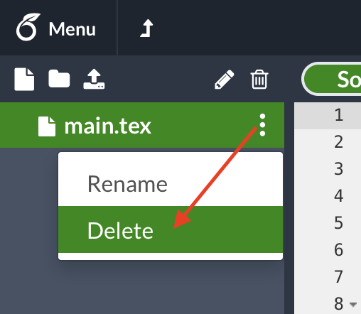

# XCS Student Code Repository
This repository contains all code for your assignment!
The build tools in this repo can be used to run the autograder locally or
compile a LaTeX submission.

# What should I submit?
Take a look at the problem set PDF:

- If it contains any questions requiring written responses, a **written (or
typeset) PDF document** submission is required (typeset instructions below).

- If contains any questions requiring coding responses, **the `submission.py`
file** must be uploaded and submitted to the autograder (local autograder
instructions below).

- Many of our problem sets will require both written (or typeset) AND coding
(submission.py) submissions. Good luck!


## Running the autograder locally
All assignment code is in the `src/` subirectory.  You will submit only the
`src/submission.py` file.  Please only make changes between the lines containing
`### START CODE HERE ###` and `### END CODE HERE ###`. Do not make changes to
files other than `src/submission.py`.

The unit tests in `src/grader.py` will be used to autograde your submission.
Run the autograder locally using the following terminal command within the
`src/` subdirectory:
```
(XCS_ENV) $ python grader.py
```

There are two types of unit tests used by our autograders:
- `basic`:  These unit tests will verify only that your code runs without
  errors on obvious test cases.

- `hidden`: These unit tests will verify that your code produces correct
  results on complex inputs and tricky corner cases.  In the student version of
  `src/grader.py`, only the setup and inputs to these unit tests are provided.
  When you run the autograder locally, these test cases will run, but the
  results will not be verified by the autograder.

For debugging purposes, a single unit test can be run locally.  For example, you
can run the test case `3a-0-basic` using the following terminal command within
the `src/` subdirectory:
```
(XCS_ENV) $ python grader.py 3a-0-basic
```

## How to create a typeset submission using LaTeX
You are welcome to typeset your submission in any legible format (including
handwritten).  For those who are trying LaTeX for the first time, consider using
the following build process (we've tried to streamline it as much as possible
for you!).  All instructions that follow are for our build process, which will
require a working installation of [TeX Live](https://www.tug.org/texlive/) (This
website has installation instructions for Windows, Linux, and Mac).  Most linux
distributions come pre-loaded with this.  Mac users can download and install it
from [mactex](https://tug.org/mactex/)

All LaTeX files are in the `tex/` subdirectory. Your question responses will be
typed into the file `tex/submission.tex`.  We recommend attempting to compile
the document before typing anything in `tex/submission.tex`.

Run `make` form the root directory.  Complete `make` documentation is
provided within the Makefile.  To get started, clone the repository and try out
a simple `make` command:
```
$ make clean -s
```

If the command runs correctly, it will remove the assignment PDF from your root
directory.  Don't worry though!  Try recreating it again using the following
command:
```
$ make without_solutions -s
```

After some file shuffling and a few passes of the LaTeX compiler, you should see
a fresh new assignment handout in the root directory.  Now try the following
command:
```
$ make with_solutions -s
```

You should now see a `\*_Solutions.pdf` file in your root directory.  This
contains the content from the original handout as well as your solutions (those
typed into `tex/submission.tex`)!  If you haven't edited `tex/submission.tex`
yet, it will probably look a lot like the `without_solutions` version.

To see what it looks like with some solution code, open up `tex/submission.tex`
and enter the following code between the tags `### START CODE HERE ###` and
`### END CODE HERE ###`:
```latex
\begin{answer}
  % ### START CODE HERE ###
  \LaTeX
  % ### END CODE HERE ###
\end{answer}
```

Now run the following command:
```
$ make -s
```

This command re-runs the default `make` target, which is, conveniently,
`make with_solutions`.  Opening the file `\*_Solutions.pdf`, you should see
something like the following:


## How to create a typeset submission using LaTeX on Overleaf
[Overleaf](https://www.overleaf.com/) is an online WYSIWYG editor.  While we
recommend becoming familiar with compiling LaTeX locally, you may instead prefer
the ease of Overleaf. Follow these steps to get set up with Overleaf (after
creating an account for yourself):

1. Create a new "Blank Project".

2. Give the project a name.
3. Delete the file named "main.tex".

4. Upload the following files to your project:
- "submission.tex"
- "macros.tex"

5. Open the Overleaf menu at the top left.

6. Change the "Main document" to "submission.tex".

7. Recompile the document.


Good luck with the assignment!  Remember that you can always submit organized
and legible handwritten PDFs instead of typeset documents.
